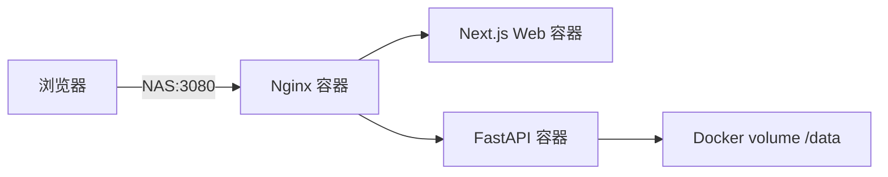
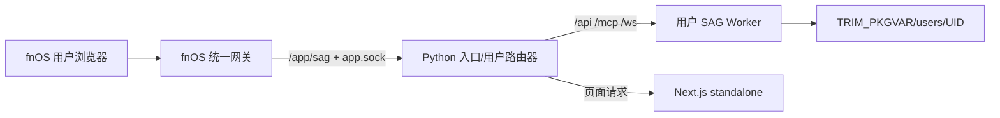

# SAG fnOS Docker 改版 Native 方案评估

> 状态：x86 Native 实现与候选构建已完成；ARM 真机验收待排期。
> 依据：`developer-fnos-native-docs.txt`（2026-08-05 快照）
> 适用分支：`fnos/develop` 及其 fnOS 长期维护分支
> 基线提交：`71d5e50`
> 日期：2026-08-05

> 融合执行入口：[`native-multi-user-implementation-plan.md`](./native-multi-user-implementation-plan.md)。该计划把 Native 包、fnOS 身份、每用户独立 Worker/数据库、生命周期和发布流水线合并为一条可执行任务链。

## 1. 评估结论

SAG 可以从 fnOS Docker 应用迁移为 Native 应用，推荐采用以下目标形态：

- 通过 `install_dep_apps` 使用 fnOS 提供的 `python312`；
- 第一阶段保留 `nodejs_v22` 和 Next.js standalone，以降低前端迁移风险；
- Python 入口服务监听 `${TRIM_APPDEST}/app.sock`，通过 fnOS 统一网关提供页面、API、SSE 和 WebSocket；
- 删除应用内 Nginx，不再暴露 `service_port=3080`；
- Python 依赖使用 CI 为 x86_64、arm64 分别构建和锁定的 Linux wheel/site-packages，随 FPK 离线交付；
- x86 为当前正式 FPK 目标；ARM 保留独立构建接口，待 ARM P0 真机验收后恢复发布；
- 用户数据全部保存在 `${TRIM_PKGVAR}`，长期运行进程以 fnOS 专用包用户运行；
- 第二阶段再将前端改造成静态应用，由 Python 直接托管，从而删除 Node 常驻进程和 `nodejs_v22` 依赖。

按当前锁定依赖实测，完整功能版 Native FPK 的可执行内容压缩后预计为：

| 架构 | Python 依赖压缩实测 | Web 产物压缩实测/估算 | FPK 目标上限 |
| --- | ---: | ---: | ---: |
| x86_64 | 250.3 MiB | 17–20 MiB | 285 MiB |
| arm64 | 226.9 MiB | 17.1 MiB | 260 MiB |

当前 Docker 三镜像的压缩层下载量约为 x86_64 449.6 MiB、arm64 429.0 MiB。Native 完整功能版预计减少约 37%–43% 的首次应用载荷，并消除 Docker 镜像拉取和三容器编排。但 Native 不是“小包应用”：LanceDB、PyArrow、LiteLLM 和本地文档解析依赖仍决定了 200 MiB 以上的压缩体积。

若产品接受“PDF/Office 只走 MinerU 等远端解析，不提供 MarkItDown 本地回退”，精简依赖模型预计可将 FPK 控制到 x86_64 210 MiB、arm64 200 MiB 左右。该选项会造成离线解析能力回退，不建议未经产品确认直接作为默认版。

## 2. 评估范围

### 2.1 包含

- fnOS Native 包结构、权限、运行时、统一网关和生命周期；
- API、Web、网关三个现有容器的 Native 替代方式；
- x86/ARM 构建与 FPK 包体积预算；
- 安装、启动、停止、状态、升级、备份和卸载；
- 多用户隔离方案对 Native 运行模型的影响；
- CI、供应链和发布验收门槛。

### 2.2 不包含

- 本文不直接实施 Native 改造；
- 不评估把 LLM、Embedding 或 MinerU 模型本地打包进 FPK；
- 不承诺 fnOS 官方未公开的 FPK 最大体积；开发文档只明确图标不超过 1024 KB，未给出应用包总大小上限；
- 不迁移已有 Docker 数据，当前产品边界是全新应用、每个 fnOS 用户空库开始。

## 3. 当前 Docker 版基线

### 3.1 运行结构



当前包的 `config/resource` 声明 `docker-project`，Compose 启动：

| 服务 | 基础运行时 | 用途 |
| --- | --- | --- |
| `api` | `python:3.12-slim` | FastAPI、任务、SQLite、LanceDB、文档解析 |
| `web` | `node:20-alpine` | Next.js standalone |
| `gateway` | `nginx:1.30.4-alpine` | `/api`、`/mcp` 和页面反向代理 |

应用以 `service_port=3080` 暴露端口，入口是独立端口服务，与 NAS 用户登录态无关；fnOS 包当前再通过 `single_user` 模式把所有用户映射到同一 SAG 用户。

### 3.2 Docker 压缩下载量实测

测量口径：读取已发布 `1.5.0-fnos.1` OCI manifest，把目标架构各压缩 layer 的 `size` 相加；不包含镜像索引、证明附件和本地解压后的 overlay2 额外占用。

| 镜像 | x86_64 | arm64 |
| --- | ---: | ---: |
| `sag-api` | 354.0 MiB | 332.4 MiB |
| `sag-web` | 70.8 MiB | 71.9 MiB |
| `sag-gateway` | 24.8 MiB | 24.7 MiB |
| **合计** | **449.6 MiB** | **429.0 MiB** |

实际磁盘占用会高于压缩下载量，因为镜像层解压后保存，运行时还会产生可写层和持久化数据。

## 4. fnOS Native 约束摘要

根据开发文档，Native 应用的关键约束如下：

1. 应用运行文件位于 `${TRIM_APPDEST}`，配置位于 `${TRIM_PKGETC}`，持久数据位于 `${TRIM_PKGVAR}`，临时文件位于 `${TRIM_PKGTMP}`。
2. 长期运行服务应通过 `cmd/main` 实现 `start`、`stop`、`status`，状态码分别使用 `0/1/3`。
3. 大多数应用应使用 `config/privilege` 的 `run-as=package`，不应让长期 Web 服务以 root 运行。
4. Python、Node.js 等运行时通过 `manifest.install_dep_apps` 声明；Python 3.12 路径为 `/var/apps/python312/target/bin`，Node 22 路径为 `/var/apps/nodejs_v22/target/bin`。
5. 统一网关通过 `${TRIM_APPDEST}` 下的 Unix Socket 转发请求，支持 NAS 登录态、用户 Header 和 WebSocket。
6. 使用统一网关时不需要 `service_port`，入口配置使用 `gatewayPrefix` 和 `gatewaySocket`。
7. 含架构相关二进制时，`manifest.platform` 必须声明 `x86` 或 `arm`；只有不包含架构二进制时才能使用 `all`。
8. 生命周期脚本应幂等，失败前把用户可执行的错误写入 `TRIM_TEMP_LOGFILE`。

## 5. 目标 Native 架构

### 5.1 第一阶段：兼容优先



Python 入口监听 `${TRIM_APPDEST}/app.sock`，承担：

- fnOS Header 校验；
- 多用户 Worker 路由；
- API、MCP、SSE 和 WebSocket 转发；
- 页面请求转发到只监听本机回环地址或私有 Socket 的 Next.js；
- readiness 和有限的静态错误页。

该阶段删除 Nginx 容器，但保留 Node 运行时和 Next standalone。这样无需在第一版同时解决 Next.js 动态路由、middleware、登录跳转和静态导出问题。

### 5.2 第二阶段：体积和进程数优化

将 Next.js 改为可静态导出的客户端应用，由 Python 入口直接托管：

- 把 `middleware.ts` 的认证/跳转逻辑移到客户端启动流程；
- 将动态聊天路径转换成可静态承载的路由形式，或为静态导出提供确定的入口页；
- 配置稳定的 `/app/sag` base path 和静态资源路径；
- 所有 API 使用相对 `/app/sag/api/...` 路径；
- 验证刷新深层 URL、语言切换、字体资源和 PWA/图标路径。

完成后可移除 `nodejs_v22` 依赖、Next server 进程和约 66 MiB 的安装后 Web standalone 内容；压缩 FPK 通常减少约 15–20 MiB。

## 6. 方案比较

### 6.1 方案 A：安装时在线 `pip install`

FPK 只包含源码和前端产物，`install_callback` 创建 venv 并从 PyPI 下载依赖。

优点：FPK 可小于 30 MiB。

缺点：

- 安装依赖公网、PyPI 可用性和 TLS；
- 依赖下载接近 200–250 MiB，并非真正减少用户流量；
- 安装时间不可预测，失败后恢复复杂；
- 供应链内容不再由发布 CI 完整固定；
- NAS 设备上编译缺 wheel 的包不现实。

结论：拒绝作为正式发布方案。

### 6.2 方案 B：FPK 内置分架构 Python 依赖（推荐）

CI 根据锁文件为 Linux x86_64、arm64 分别准备 wheel/site-packages，并分别打 FPK。安装过程只做文件展开和权限初始化，不访问公网。

优点：

- 包内容可复现、可扫描、可签名；
- 安装成功率高，适合 NAS；
- 体积可以在 CI 中设置硬阈值；
- 避免在 NAS 上编译 C/C++/Rust 扩展。

缺点：

- FPK 约 245–285 MiB；
- 必须维护双架构产物；
- 要验证 wheel 的 glibc 和 fnOS 兼容性。

结论：正式发布首选。

### 6.3 方案 C：PyInstaller 单文件/单目录

把 API 及 Python 运行时冻结为自包含可执行文件。

优点：不依赖 fnOS Python runtime，启动命令简单。

缺点：

- LanceDB、PyArrow、ONNX Runtime、动态导入和 LiteLLM 会使收集规则复杂；
- 体积不一定低于 wheel/site-packages；
- 二进制兼容、证书、时区、插件和动态库问题更难诊断；
- 漏包往往在特定解析路径运行时才暴露。

结论：不作为第一版；只有 fnOS `python312` 兼容性无法满足时再做备选验证。

### 6.4 方案 D：精简解析能力

从核心依赖移除 `markitdown[docx,pdf,pptx,xls,xlsx]` 和本地网页解析回退，只保留 MinerU/远端解析路径。

优点：预计压缩体积减少约 50–80 MiB，安装后减少约 160–230 MiB。

缺点：

- NAS 离线或未配置 MinerU 时无法解析 PDF/Office；
- 与当前 `document_parser=auto` 的本地回退语义不一致；
- 必须在 UI 中明确能力和错误提示。

结论：作为可选 Slim SKU 或后续可选组件，不替换默认完整功能版。

## 7. 包体积实测与预算

### 7.1 测量方法

Python 完整依赖根据 `apps/api/uv.lock` 导出生产 requirements，使用 Python 3.12 目标分别解析 Linux x86_64 和 aarch64 wheels，安装到临时目录后统计：

- 安装目录逻辑占用；
- 使用 gzip 对完整目录归档后的压缩占用。

Web 使用当前 `npm ci && npm run build` 的 `.next/standalone`、`.next/static` 和 `public` 测量。开发依赖和 `.next` 构建缓存不进入 FPK。

### 7.2 完整依赖实测

| 内容 | x86_64 | arm64 | 备注 |
| --- | ---: | ---: | --- |
| Python 生产依赖安装目录 | 819 MiB | 755 MiB | 不含 fnOS Python runtime |
| Python 生产依赖 gzip | 250.3 MiB | 226.9 MiB | FPK 体积主要来源 |
| Next standalone 安装目录 | 约 66 MiB | 66 MiB | 当前在 ARM 开发机构建实测 |
| `.next/static` + `public` | 约 4.6 MiB | 约 4.6 MiB | 包含静态 chunk/资源 |
| Web 运行内容 gzip | 17–20 MiB | 17.1 MiB | x86 需在 CI 最终复测 |

最大的 Python 安装项为：

| 依赖 | x86_64 安装占用 | 作用 |
| --- | ---: | --- |
| `pyarrow` | 152 MiB | LanceDB/Arrow 数据层 |
| `lancedb` | 146 MiB | 本地向量库 |
| `litellm` | 69 MiB | 多模型调用适配 |
| `pandas` | 42 MiB | 表格解析链路 |
| `onnxruntime` | 37 MiB | Magika 文件类型识别 |
| `sympy` | 29 MiB | ONNX Runtime 依赖链 |
| `numpy` + native libs | 约 57 MiB | 向量/Arrow/解析依赖 |

因此只删除 Nginx 或压缩源码不会显著降低包体积，优化应针对运行架构和解析依赖链。

### 7.3 CI 硬预算

完整功能版建议设置：

| 指标 | x86_64 失败阈值 | arm64 失败阈值 |
| --- | ---: | ---: |
| 最终 `.fpk` | 285 MiB | 260 MiB |
| 解包后应用目录（不含用户数据和共享 runtime） | 930 MiB | 860 MiB |
| 单版本相对增长预警 | 10 MiB | 10 MiB |
| 单版本相对增长阻断 | 25 MiB | 25 MiB |

精简版建议设置：

| 指标 | x86_64 失败阈值 | arm64 失败阈值 |
| --- | ---: | ---: |
| 最终 `.fpk` | 210 MiB | 200 MiB |
| 解包后应用目录 | 680 MiB | 650 MiB |

这些阈值不是 fnOS 官方上限，而是 SAG 自身的发布预算。首次 Native CI 应记录 fnpack 最终算法产生的真实 FPK 大小；若与 gzip 模拟值偏差超过 5%，先更新测量模型，再决定是否调整阈值。

### 7.4 体积报告要求

每次发布产出机器可读报告，至少包含：

```json
{
  "architecture": "x86_64",
  "fpk_bytes": 0,
  "unpacked_app_bytes": 0,
  "python_dependencies_bytes": 0,
  "web_runtime_bytes": 0,
  "top_20_paths": [],
  "baseline_version": "1.5.0-fnos.1",
  "delta_bytes": 0
}
```

CI 应同时上传 SBOM、wheel 清单、哈希和体积报告，便于解释包增长来源。

## 8. 包结构建议

x86 和 ARM 使用同一源码模板、分别渲染：

```text
packages/fnos/native/sag/
├── ICON.PNG
├── ICON_256.PNG
├── manifest
├── app/
│   ├── server/
│   │   ├── sag_api/
│   │   ├── sag_agent/
│   │   ├── vendor/          # 对应架构的 Python 依赖
│   │   └── web/             # Next standalone 或静态导出
│   └── ui/
│       ├── config
│       └── images/
├── cmd/
│   ├── install_init
│   ├── install_callback
│   ├── main
│   ├── upgrade_init
│   ├── upgrade_callback
│   ├── uninstall_init
│   └── uninstall_callback
├── config/
│   ├── privilege
│   └── resource
└── wizard/
```

不要在仓库提交构建出的 `vendor`。CI 从锁文件生成临时打包目录，验证后交给 fnpack。

## 9. Manifest、权限和资源

### 9.1 Manifest

第一阶段 x86 示例：

```ini
appname=sag
version=1.6.0-fnos.1
display_name=SAG知识库
desc=AI 知识库 · 让散落文档汇聚为可检索、可追溯的知识
platform=x86
os_min_version=1.2.0401
source=thirdparty
maintainer=Zleap AI
distributor=Zleap AI
install_dep_apps=python312:nodejs_v22
ctl_stop=true
desktop_uidir=ui
desktop_applaunchname=sag.Application
```

ARM 包把 `platform` 改为 `arm`。第二阶段静态前端完成后，将依赖缩减为 `python312`。

建议把最低系统版本提升到实际完成统一网关、用户 Header 和目标开放 API 验证的版本。文档快照中开放 API 要求 fnOS `1.2.0401` 及以上，因此涉及新授权 API 时采用该下限；最终以真机验证结果为准。

### 9.2 权限

```json
{
  "defaults": {
    "run-as": "package"
  },
  "username": "sag",
  "groupname": "sag"
}
```

当前 Docker 包声明 `run-as=root`。Native 长期进程必须改为专用包用户。只有确有必要的安装准备动作才允许在生命周期阶段使用更高权限，并且启动服务前降权。

### 9.3 资源

第一版数据只保存在应用私有目录，不需要 `docker-project` 或 `data-share`：

```json
{}
```

若未来让用户从 NAS 目录导入文件，应使用用户个人授权 API 和 ACL 检查，而不是把内部数据库或上传目录声明成共享目录。

## 10. 服务生命周期

### 10.1 安装

`install_init/install_callback` 应：

1. 检查 `python312`、第一阶段的 `nodejs_v22` 和目标架构；
2. 创建 `${TRIM_PKGVAR}/users`、`${TRIM_PKGVAR}/backup`、`${TRIM_PKGETC}`；
3. 生成模式 `0600` 的内部签名密钥；
4. 验证 vendor 中关键 native 模块可导入；
5. 不启动用户 Worker，不预建任何用户知识库；
6. 失败时写入 `TRIM_TEMP_LOGFILE`，不留下半初始化密钥或目录。

### 10.2 启动

`cmd/main start` 应：

- 把 fnOS runtime 加入 `PATH`；
- 清理确认无进程持有的陈旧 Socket；
- 启动 Python 路由器并监听 `${TRIM_APPDEST}/app.sock`；
- 第一阶段启动本机 Next server；
- 使用原子 PID 文件；
- 等待 UDS readiness 成功后才返回 0。

不能用模糊的 `pgrep -f` 或 `pkill -f` 管理进程，应校验 PID、进程启动时间和可执行路径，避免误杀其他应用。

### 10.3 状态

`cmd/main status` 只有在以下条件全部满足时返回 0：

- 路由器 PID 存活且身份匹配；
- `${TRIM_APPDEST}/app.sock` 是当前服务创建的 Socket；
- readiness 请求返回预期 JSON；
- 第一阶段 Next server 健康。

否则写明具体原因并返回 3。

### 10.4 停止

停止顺序：

1. 路由器停止接收新请求；
2. 等待在途请求和任务检查点；
3. 优雅停止所有用户 Worker；
4. 停止 Next server；
5. 停止路由器；
6. 删除 PID 和 Socket；
7. 超时后才逐个强制终止明确归属本应用的进程。

### 10.5 升级

升级前必须冷备份完整 `${TRIM_PKGVAR}/users`。Native 版不能继续依赖 Docker lifecycle 容器，应把现有归档安全检查迁移到本机脚本或受测 Python helper：

- 先检查数据大小和可用空间；
- 停止写入后归档；
- 临时文件与最终文件位于同一文件系统；
- 归档成功后原子改名；
- 升级失败时恢复旧应用文件，用户数据不回滚覆盖；
- 数据 schema 迁移必须支持中断检测和明确的版本标记。

### 10.6 卸载

默认保留用户数据。卸载向导只有在管理员明确选择永久删除时才清理。删除时拒绝符号链接、非规范路径和不属于应用数据根目录的目标。

## 11. 路由和前端改造点

### 11.1 统一前缀

所有页面、静态资源、API、MCP、SSE 和 WebSocket 都必须位于 `/app/sag` 下：

```text
/app/sag/
/app/sag/api/v1/...
/app/sag/mcp/...
/app/sag/ws/...
/app/sag/_next/...
```

不得假设部署在域名根路径。前端只使用相对 URL 或统一的 base path 构造器。

### 11.2 认证

- 生产模式不显示 SAG 登录/注册页；
- 缺少 fnOS 身份 Header 时直接拒绝，不能回退到 `single_user` 默认用户；
- 本地开发可以显式开启开发身份，但该开关不得进入生产 manifest；
- WebSocket 在握手时固定 UID，后续消息中的 UID 一律忽略。

### 11.3 字体和离线资源

当前 Next 构建会访问 Google Fonts。发布构建必须把 Inter 和 JetBrains Mono 固定版本作为本地资源随包交付，避免 CI 或 NAS 安装依赖外网。CI 应在禁网构建测试中验证没有远程字体或运行时 CDN 请求。

## 12. 架构与兼容性风险

### 12.1 Native wheels

LanceDB、PyArrow、ONNX Runtime、NumPy、Pydantic Core、uvloop、LXML、Cryptography 等均包含本地二进制。必须验证：

- x86_64 与 arm64 均有 Python 3.12 Linux wheel；
- wheel 所需 glibc/libstdc++ 不高于目标 fnOS；
- CPU 指令集不要求过新的 x86 特性；
- ARM wheel 为 `aarch64`/`arm64 v8`，不误用 32 位 ARM；
- `ldd` 不存在缺失动态库；
- 干净设备可导入所有关键模块并完成一次 LanceDB 写入/查询。

### 12.2 运行时依赖变化

fnOS runtime 包名和版本是外部契约。发布前应在干净设备验证自动安装依赖、PATH、升级和卸载顺序。不要在生命周期脚本中静默下载另一份 Python 或 Node。

### 12.3 文件系统和 UDS

- 网关 Socket 必须位于 `${TRIM_APPDEST}` 且名称与 UI 配置一致；
- 安装目录升级替换前必须停止进程并清理 Socket；
- Unix Socket 路径长度需在目标机实测；
- 用户数据和数据库不能放 `${TRIM_APPDEST}`，否则升级可能覆盖。

## 13. CI/CD 设计

建议在现有 `fnos-release.yml` 旁新增 Native 构建流程，成熟后替代 Docker image jobs：

1. 校验版本、分支和发布确认；
2. Web 依赖锁定安装并构建 standalone/静态产物；
3. 生成 x86_64 Linux Python vendor；
4. 生成 arm64 Linux Python vendor；
5. 对两个 vendor 运行恶意包名、符号链接、ELF 架构和动态库检查；
6. 生成两个临时 fnOS 包目录；
7. 运行生命周期脚本静态测试和包结构测试；
8. 用 `fnpack build` 生成两个 FPK；
9. 执行包体积硬门禁和相对增长检查；
10. 生成 SHA-256、SBOM、依赖许可证和漏洞扫描报告；
11. 在对应架构 fnOS 真机安装、启动、升级、卸载并做 smoke test；
12. 发布 FPK 和体积报告。

构建环境不能用宿主 macOS 的 venv 直接打包；本次 macOS 安装测量只用于确认依赖构成，最终包必须来自 Linux 目标 wheel 流程。

## 14. 测试与验收

### 14.1 功能等价

- 首次打开、设置模型、创建信源、上传文档、解析、检索、对话、SSE、MCP 均可用；
- Next 页面在 `/app/sag` 深层路径刷新正常；
- 上传 25 MiB 边界、长时间解析和大模型流式回答不被网关提前断开；
- x86 和 ARM 使用同一版本号、功能一致；
- 多用户隔离按独立方案全部通过。

### 14.2 生命周期

- 干净 fnOS 自动安装 runtime 依赖并成功启动；
- 重复 `start/stop` 幂等；
- `status` 能区分进程存在、Socket 不可用和 API 未就绪；
- NAS 重启后无残留 PID/Socket；
- 升级前空间不足时不停止或修改现有数据；
- 升级失败可恢复服务且保留数据；
- 卸载默认保留数据，显式删除才清理。

### 14.3 性能和资源

在 2 GB、4 GB、8 GB 设备分别记录：

- 冷启动和热启动时间；
- 首用户 Worker 启动时间；
- 单 Worker RSS/PSS；
- 4 用户并发时路由器、Worker 和 Node 总内存；
- 文档解析峰值内存；
- 1000 次检索后的文件描述符、线程和内存变化；
- Worker 回收后内存是否归还。

### 14.4 包体积

- 最终 FPK 不超过架构硬阈值；
- 报告能解释前 20 个最大目录/文件；
- 相对上一版本增长超过 10 MiB 必须在 PR 中说明；
- 安装过程和首次启动不得额外下载 Python/npm 依赖；
- 不把测试、类型声明、源码映射、构建缓存、开发依赖或 `__pycache__` 打入正式包。

## 15. 分阶段迁移计划

### P0：兼容性样机

- 创建最小 Native 包；
- 验证 `python312`、UDS、统一网关、Header、SSE 和 WebSocket；
- 在 x86/ARM 真机导入 LanceDB、PyArrow 和 ONNX Runtime；
- 用真实 fnpack 得到最终 FPK 大小。

退出条件：两架构可安装、启动并完成一次文档写入/检索，包体积未超过预算。

### P1：单用户功能等价

- API 和 Next standalone Native 化；
- 删除 Nginx/Docker 编排；
- 完成 Native 生命周期和冷备份；
- 保持单用户工作区，验证功能等价。

退出条件：Docker 版核心 smoke tests 在 Native 上全部通过。

### P2：fnOS 多用户隔离

- 实现用户路由器和独立 Worker；
- 每个 UID 空库初始化；
- 加入 Worker 上限、回收、配额和管理状态；
- 完成双用户越权与并发测试。

退出条件：多用户方案的发布门槛全部满足。

### P3：包体积优化

- 尝试静态导出前端并删除 Node runtime；
- 本地字体化；
- 清理测试、缓存、map、无用 metadata；
- 评估可选 Slim 解析版，但不默默降低默认功能。

退出条件：功能无回退，或 Slim 版作为明确独立 SKU 发布。

### P4：替换正式交付

- Native 与 Docker 候选版并行灰度；
- 收集安装失败率、启动时间、内存和磁盘数据；
- 达到稳定性门槛后停止发布新的 Docker 版；
- 保留一个版本周期的回退说明和诊断工具。

## 16. Go/No-Go 决策

满足以下条件时建议 Go：

1. x86、ARM 真机均能使用官方 Python runtime 导入所有 native 依赖。
2. 完整功能 FPK 分别不超过 285 MiB、260 MiB。
3. 安装和首次启动不依赖 PyPI、npm registry、Google Fonts 或镜像仓库。
4. UDS 网关下页面、API、SSE、WebSocket 和大文件上传稳定。
5. 专用包用户权限下所有目录、备份和升级流程正常。
6. 多用户 Worker 模型在目标低内存设备上满足资源上限。

任一情况应 No-Go 并保留 Docker 交付：

- 关键 wheel 与目标 fnOS glibc/CPU 不兼容；
- 只能通过安装时在线编译才能运行；
- Native 峰值内存或多 Worker 成本显著高于目标 NAS 能力；
- 无法在 UDS 统一网关下稳定支持现有流式能力；
- 包体积超过预算且只能通过未获产品确认的功能删减才能达标。

## 17. 最终建议

建议启动 Native P0/P1，但不要立即删除 Docker 发布链路。技术上最大的风险不是 fnpack 或生命周期脚本，而是：

1. Python 本地依赖与 fnOS 两种架构的兼容性；
2. 多用户 Worker 的内存成本；
3. Next.js 在 `/app/sag` 统一前缀下的运行和后续静态化；
4. 冷备份和升级期间对 SQLite/LanceDB 的一致性保护。

包体积已经有可操作的控制线：默认完整功能版按 x86 285 MiB、ARM 260 MiB 封顶，CI 阻止无解释增长；后续通过静态前端和可选 Slim 解析版继续下降。与当前约 430–450 MiB 的 Docker 压缩镜像下载相比，Native 在分发体积、启动链路、fnOS 登录态集成和运维可见性方面具有明确收益。
