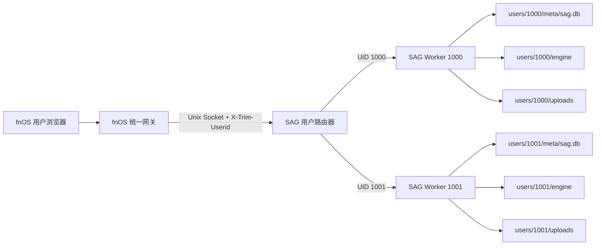
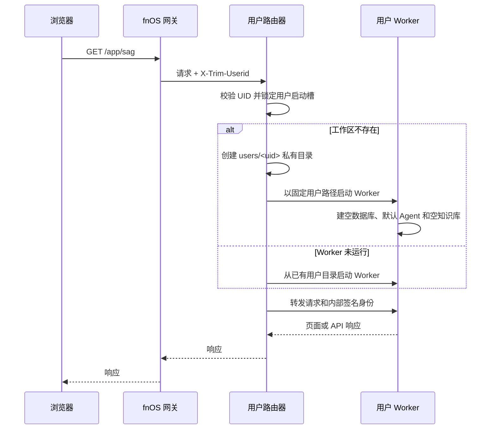

# SAG fnOS 多用户数据隔离方案

> 状态：设计方案
> 适用分支：`fnos/develop` 及其 fnOS 长期维护分支
> 基线提交：`71d5e50`
> 日期：2026-08-05

> 融合执行入口：[`native-multi-user-implementation-plan.md`](./native-multi-user-implementation-plan.md)。实施 Agent 应按该计划统一完成 Native 化与用户隔离，不要把本文件单独当作代码任务清单。

## 1. 结论摘要

fnOS 版本应采用“一个 fnOS 用户对应一个独立 SAG 工作区”的模型。工作区至少独立包含：

- SAG 元数据 SQLite 数据库；
- zleap-sag 的 SQLite/LanceDB 数据；
- 上传文件和对话附件；
- 用户级运行配置；
- 后台任务状态和知识宇宙快照。

推荐实现为“统一网关入口 + 轻量用户路由器 + 按用户启动的 SAG Worker”。路由器只信任 fnOS 统一网关注入的 `X-Trim-Userid`，把请求转发到该 UID 对应的 Worker；每个 Worker 使用固定的数据根目录和独立数据库。这样无需给现有大量业务表补 `owner_id`，也不会因某个查询漏写用户过滤条件而泄露其他用户数据。

本应用是全新应用，没有旧用户或旧共享知识库，因此不设计历史数据认领、复制或公共库兼容逻辑。每个用户第一次打开应用时创建空白工作区。

## 2. 背景与现状

### 2.1 当前 fnOS 交付形态

当前 fnOS 包使用 Docker Compose 启动 API、Web 和 Nginx 三个容器，并设置：

```text
SAG_AUTH_MODE=single_user
SAG_DATABASE_URL=sqlite+aiosqlite:////data/sag.db
SAG_DATA_DIR=/data/engine
SAG_UPLOAD_DIR=/data/uploads
```

所有请求最终进入同一个 API 进程、同一个元数据库和同一个引擎目录，因此 NAS 上的多个系统用户看到的是同一个 SAG 工作区。

### 2.2 现有模型不能依靠行级过滤完成快速隔离

当前代码虽然有 `User` 模型，部分知识宇宙表也带有 `user_id`，但核心资源并没有完整的所有权字段：

| 数据域 | 主要表或目录 | 当前所有权情况 |
| --- | --- | --- |
| 信源 | `sources` | 无 `user_id` |
| 文档 | `documents` | 只关联 `source_id` |
| 处理任务 | `jobs` | 只关联信源或文档 |
| Agent | `agents`、`agent_bindings` | 无 `user_id` |
| 对话 | `threads`、`messages` | 无 `user_id` |
| 设置 | `settings` | 仅有逻辑 `scope`，无所有者外键 |
| 知识引擎 | `SAG_DATA_DIR` | 所有信源共用数据根目录 |
| 上传文件 | `SAG_UPLOAD_DIR` | 所有用户共用目录 |

API 层目前普遍只检查“已经认证”，服务层的 `list_sources()`、`get_source()`、`list_agents()` 等查询不会按用户过滤。因此只替换登录方式并不能获得数据隔离。

## 3. 目标与非目标

### 3.1 目标

1. fnOS 用户 A 无法查询、读取、修改或删除用户 B 的任何 SAG 数据。
2. 用户首次访问时自动得到一个空白工作区，不需要 SAG 二次注册或设置密码。
3. UID 对应的数据目录清晰、可备份、可统计、可单独诊断。
4. 尽量复用现有单用户 SAG 代码，避免对所有表、查询和后台任务进行高风险改造。
5. 支持同一台 NAS 上多个用户并发使用，并对 Worker 数量和内存设置硬上限。
6. 所有外部访问都通过 fnOS 统一网关，应用不暴露独立 TCP 服务端口。

### 3.2 非目标

- 不提供跨用户共享知识库、共享 Agent 或协作空间。
- 不提供管理员代用户浏览知识内容的能力。
- 不迁移旧 Docker 版共享知识库。
- 不把“数据库分开”描述为抵御应用进程被完全攻破的安全边界；所有 Worker 仍运行在同一个 fnOS 包用户下。
- 第一阶段不处理 fnOS 用户删除事件或 UID 复用的自动清理；由管理员显式清理孤立工作区。

## 4. 方案比较

### 4.1 方案 A：单库加 `owner_id`

做法是在信源、文档、任务、Agent、对话和设置等表补 `user_id`，所有查询强制附加用户条件，知识引擎仍在共享目录内按用户命名空间划分。

优点：

- 单进程资源利用率最好；
- 便于未来实现共享知识库和团队空间；
- 跨用户的管理员统计较容易。

缺点：

- 改动面最大，任何一个漏过滤的查询都可能形成越权；
- zleap-sag 的全局运行时和数据目录仍需做租户化改造；
- 后台任务、缓存、附件路径、MCP、知识宇宙都要逐项加入租户上下文；
- 与本次“简单、独立数据库、不共享知识库”的目标不匹配。

结论：不作为 fnOS 第一版方案。

### 4.2 方案 B：单进程动态切换用户数据库

做法是一个 FastAPI 进程根据请求 UID 动态选择 SQLAlchemy Session、引擎目录和上传目录。

优点：

- 不需要多个 Worker；
- 可以保持单一服务生命周期。

缺点：

- 当前数据库引擎、Session 工厂、`EngineManager`、任务队列和部分 zleap-sag 数据库状态按应用单例初始化；
- 请求级动态切换会把租户上下文传播到几乎所有依赖；
- 后台任务脱离 HTTP 请求后容易丢失租户信息；
- 多用户并发时，全局缓存或 ContextVar 使用不当会造成串库。

结论：表面简单，实际风险高，不推荐。

### 4.3 方案 C：用户路由器 + 每用户独立 Worker（推荐）

做法是保留 SAG 的“单 Worker = 单工作区”假设。入口路由器读取 fnOS UID，为用户启动或复用独立 Worker。每个 Worker 在启动时获得固定环境变量：

```text
SAG_DATABASE_URL=sqlite+aiosqlite:////.../users/<uid>/meta/sag.db
SAG_DATA_DIR=/.../users/<uid>/engine
SAG_UPLOAD_DIR=/.../users/<uid>/uploads
SAG_AUTH_MODE=single_user
```

优点：

- 数据库、引擎、上传目录和进程内缓存天然隔离；
- 最大限度复用当前 API、服务和任务代码；
- 某个 Worker 崩溃只影响一个用户；
- 可按 UID 做备份、配额、诊断和删除；
- 不依赖每条 SQL 都正确携带用户过滤条件。

缺点：

- 每个活跃用户会增加一个 Python 进程和一套连接池/缓存；
- 需要实现 Worker 生命周期、空闲回收和请求转发；
- 需要防止长任务执行期间错误回收 Worker。

结论：最符合当前代码结构和产品范围，作为第一版落地方案。

## 5. 推荐架构



### 5.1 外部入口

桌面入口使用统一网关：

```json
{
  ".url": {
    "sag.Application": {
      "title": "SAG知识库",
      "type": "iframe",
      "protocol": "",
      "gatewayPrefix": "/app/sag",
      "gatewaySocket": "app.sock",
      "url": "/app/sag",
      "allUsers": true
    }
  }
}
```

fnOS 先验证 NAS 登录态，再向 Unix Socket 转发请求，并提供：

- `X-Trim-Userid`：稳定身份主键；
- `X-Trim-Username`：仅用于显示，可发生改名；
- `X-Trim-Isadmin`：仅用于应用管理操作，不授予读取其他用户数据的权限。

### 5.2 用户路由器职责

路由器只承担以下职责：

1. 验证请求来自统一网关使用的 Unix Socket。
2. 要求 `X-Trim-Userid` 为非空十进制 UID，并设置长度上限。
3. 忽略客户端请求中任何自行提交的 UID。
4. 以 UID 查找 Worker；不存在时进行并发安全的首次创建。
5. 将请求转发到 Worker 的私有 Unix Socket。
6. 转发 SSE、流式响应和 WebSocket，不做响应内容缓存。
7. 维护 Worker 的最近活动时间、在途请求数和后台任务状态。
8. 记录结构化审计日志，但不记录用户文档、提示词、密钥或完整请求体。

路由器不查询任何用户业务数据库，不实现知识库业务，不提供跨用户聚合接口。

### 5.3 Worker 身份桥接

Worker 不能直接信任从浏览器传来的 `X-Trim-*` Header。路由器在转发前应：

1. 删除所有外部 `X-Trim-*` 和 `X-SAG-Internal-*` Header；
2. 根据已验证的网关 UID 选择 Worker；
3. 通过私有 Unix Socket 转发；
4. 注入固定内部身份，例如 `X-SAG-Internal-UID`；
5. 使用安装时生成的内部密钥对 UID、时间戳和请求 ID 做 HMAC，Worker 校验后再建立单用户会话。

即使 Worker Socket 因文件权限配置错误被其他本机进程访问，内部签名也能提供额外保护。

### 5.4 用户目录布局

应用私有数据放在 `${TRIM_PKGVAR}`，不声明为用户可见共享目录：

```text
${TRIM_PKGVAR}/
├── users/
│   ├── 1000/
│   │   ├── identity.json
│   │   ├── meta/sag.db
│   │   ├── engine/
│   │   ├── uploads/
│   │   └── logs/
│   └── 1001/
│       └── ...
├── run/
│   ├── router.pid
│   └── workers.json
├── config/
│   └── internal-secret
└── backup/
```

运行期 Socket 和临时 PID 优先放 `${TRIM_PKGTMP}`；若系统重启会清理该目录，启动脚本必须可幂等重建。

目录规则：

- UID 只允许十进制数字，目录名不得使用用户名；
- 用户目录创建后权限设为 `0700`，文件默认 `0600`；
- 使用 `openat`/安全路径拼接或等价措施，禁止 `..`、符号链接替换和路径穿越；
- `identity.json` 记录 UID、最近一次用户名、创建时间和最后访问时间，不作为认证依据；
- 数据库 WAL、SHM、LanceDB 和上传文件全部位于同一用户根目录，便于一致备份。

## 6. 用户首次访问流程



并发首次访问必须使用 UID 级互斥锁和原子目录创建，避免启动两个 Worker 或初始化两次默认数据。

## 7. Worker 生命周期和资源控制

### 7.1 默认限制

建议第一版使用以下保守值，并允许在 fnOS 配置向导中调整：

| 项目 | 默认值 | 规则 |
| --- | ---: | --- |
| 同时运行 Worker 上限 | 4 | 超限时回收最久空闲且无后台任务的 Worker |
| Worker 空闲回收时间 | 15 分钟 | 无在途请求、无 SSE/WebSocket、无后台任务才可回收 |
| 单 Worker 任务并发 | 1 | 延续当前 fnOS 配置 |
| 单 Worker 引擎缓存 | 2 | 比当前全局 4 更保守，控制多用户内存 |
| 启动超时 | 60 秒 | 超时终止子进程并返回可重试错误 |
| 优雅停止时间 | 15 秒 | 超时后强制终止并记录错误 |

具体 Worker 上限应在 2 GB、4 GB、8 GB 内存设备上压测后分档，不应只按 CPU 核数推导。

### 7.2 后台任务

- Worker 有 `queued` 或 `running` 任务时不得因空闲超时退出。
- 应用整体停止时，先停止接收新请求，再请求 Worker 停止领取新任务。
- 正在处理的任务应完成当前可恢复检查点或标记为可重试，再退出。
- 重启后只允许任务归属 Worker 扫描自己的数据库，不能全局扫描其他用户任务。

### 7.3 过载行为

达到 Worker 上限且没有可回收 Worker 时，新用户请求返回 `503`，响应包含短暂重试提示。不得为了接纳新用户而杀死正在执行后台任务或有流式对话的 Worker。

## 8. 数据访问与权限规则

### 8.1 业务数据

每个 Worker 只拿到自己的三个路径和元数据库 URL。业务代码不接受外部 `user_id` 来选择目录或数据库。

### 8.2 NAS 用户文件

若未来支持从 NAS 文件管理器导入文件，应接入 fnOS 用户个人授权路径：

1. 前端通过 `pickUserFile` 让当前用户授权目录或文件；
2. 后端用网关 UID 查询当前用户授权目录；
3. 读取、预览、写入或删除前调用 `trim.file.checkUserACL`；
4. 授权文件复制或导入后，知识库派生数据仍写入当前用户私有工作区；
5. 不因应用包用户获得 ACL 就把路径内容提供给其他用户。

第一版若只支持浏览器上传，则不需要申请 NAS 文件目录授权。

### 8.3 管理员权限

`X-Trim-Isadmin=true` 只允许执行运行状态、磁盘用量和孤立工作区清理等管理动作。管理接口默认只能返回：

- UID；
- 最近一次显示用户名；
- 工作区总字节数；
- Worker 状态；
- 最后活动时间；
- 任务数量和健康状态。

管理员接口不得返回文档标题、对话内容、知识实体、API 密钥或附件内容。

## 9. 配额和磁盘管理

### 9.1 配额模型

第一版建议同时实现：

- 单文件上传上限：沿用 25 MiB；
- 单用户工作区软上限：默认 20 GiB；
- NAS 剩余空间保护线：剩余空间低于 10% 或 5 GiB 时拒绝新的大文件写入，取较大者；
- 管理员可查看每个 UID 的用量，但不可查看内容。

### 9.2 用量统计

路由器维护异步缓存的目录用量，不应在每个上传请求中递归扫描完整目录。写入前使用缓存值加本次预计增量做快速判断，后台定期做实际校准。

## 10. 备份、恢复和卸载

### 10.1 备份

整包备份按以下顺序执行：

1. 路由器进入维护模式，停止接受写请求；
2. 等待在途请求和后台任务达到安全检查点；
3. 优雅停止所有 Worker；
4. 对 `${TRIM_PKGVAR}/users` 创建完整归档；
5. 归档写入临时文件，校验成功后原子改名；
6. 恢复服务。

不能在 SQLite/LanceDB 活跃写入时直接复制目录并宣称是一致备份。

### 10.2 恢复

恢复必须验证：

- 归档路径不能逃逸用户数据根目录；
- UID 目录格式合法；
- 文件所有者和权限正确；
- SQLite 完整性检查通过；
- Worker 能以该目录启动并通过 readiness；
- 恢复失败时保留原数据和恢复前快照。

### 10.3 卸载

默认保留全部用户数据。只有管理员在卸载向导明确选择“永久删除所有 SAG 用户数据”时，才允许删除 `${TRIM_PKGVAR}/users`。不提供普通用户从 UI 删除其他用户工作区的入口。

## 11. 错误处理

| 场景 | 对外行为 | 内部处理 |
| --- | --- | --- |
| 缺少或非法 UID Header | `401/403` | 不创建目录，不启动 Worker |
| Worker 启动失败 | `503` + 可重试提示 | 清理残留 Socket/PID，保留数据，记录错误码 |
| 数据库损坏 | `503` + 联系管理员 | 禁止自动重建覆盖，保留现场 |
| 达到 Worker 上限 | `503` + `Retry-After` | 尝试回收无任务的最久空闲 Worker |
| 用户空间不足 | `507 Insufficient Storage` | 不开始解析任务，清理临时文件 |
| 后台任务异常退出 | 展示可重试失败 | 按现有任务重试上限恢复，不跨用户扫描 |
| 路由器重启 | 短暂 `503` | 根据 PID/Socket 实际状态重建注册表 |

错误日志必须携带请求 ID 和 UID，但不得包含认证 Header、密钥、文档正文或完整提示词。

## 12. 测试与验收

### 12.1 隔离测试

至少创建 fnOS 用户 A、B 和管理员 C，验证：

- A、B 首次打开均看到空知识库；
- A 创建信源、上传文档、创建 Agent 和对话后，B 的列表均为空；
- B 猜测 A 的 source/document/agent/thread/message ID 时得到 `404`，不能通过状态码确认资源存在；
- A、B 使用相同文件名、Agent 名或设置键不会冲突；
- A 删除自己的信源不会修改 B 的目录和数据库；
- 管理员 C 也只有自己的空知识库，不能凭管理员身份读取 A/B 内容；
- 伪造 `X-Trim-Userid` 或直接访问 Worker Socket失败；
- WebSocket 和 SSE 在建立后始终绑定建立连接时的 UID。

### 12.2 并发与生命周期测试

- 同一 UID 并发 20 个首次请求只创建一个目录和一个 Worker；
- 4 个用户同时检索和上传时不会串库；
- 达到 Worker 上限后的第五个用户行为符合过载规则；
- 有后台任务、SSE 或 WebSocket 的 Worker 不被空闲回收；
- 路由器崩溃重启后能清理失效 Socket 并恢复用户访问；
- 应用停止、升级和 NAS 重启后没有孤儿进程。

### 12.3 数据测试

- 每个 UID 的 `sag.db`、引擎目录和上传目录只包含该用户操作产生的数据；
- 冷备份恢复后用户间隔离关系不变；
- 磁盘不足、备份失败和数据库损坏时不会重建或覆盖原数据；
- 用户名变更后仍通过 UID 访问原工作区。

## 13. 分阶段实施建议

### 阶段 1：身份和目录骨架

- 接入统一网关和 UDS；
- 实现严格的 Header 校验；
- 建立 UID 目录和空工作区初始化；
- 先只允许一个 Worker，验证端到端路径。

### 阶段 2：Worker 管理

- 实现按 UID 启动、健康检查、转发和停止；
- 加入并发启动锁、空闲回收、Worker 上限；
- 迁移 SSE/WebSocket 和后台任务生命周期。

### 阶段 3：运维能力

- 加入按 UID 用量统计、空间保护、管理状态页；
- 改造备份、恢复、升级和卸载流程；
- 完成多用户、低内存和故障注入测试。

## 14. 发布门槛

满足以下条件才可将多用户模式标记为正式可用：

1. 所有外部请求只通过 fnOS 统一网关进入。
2. 缺少有效 UID 的生产请求全部拒绝，不允许回退到 `local` 或默认用户。
3. 核心业务表不依赖行级 owner 过滤也能通过双用户越权测试。
4. 每个 Worker 的数据库、引擎和上传路径固定在唯一 UID 目录。
5. Worker 上限、空闲回收和后台任务保护通过压力测试。
6. 冷备份/恢复验证覆盖至少两个用户，并通过 SQLite 完整性检查。
7. 普通用户和管理员均无法读取其他 UID 的知识内容。

## 15. 后续演进

未来若产品需要共享知识库或团队协作，应新增显式 Workspace/Member/Role 模型，而不是直接让一个用户 Worker 读取另一个 UID 目录。届时应作为独立架构项目评估，可能需要迁移到“共享服务 + 行级租户”的模型；本方案不预留隐式跨库访问捷径。
