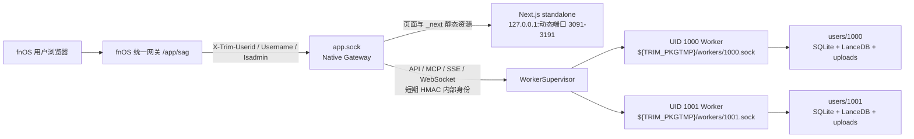

# SAG fnOS Native 当前架构、改造明细与后续交接

审计日期：2026-08-06（Asia/Shanghai）

目标分支：`codex/fnos-native-maintenance`

基线：`origin/fnos/develop` @ `71d5e50c6b7c201d94e11dc4aaf7a3fa547c727a`

本文审计快照：`074c5dbdbc535e48cc1fb3f45c674f479f07e2c7`

适用目标：先完成并发布 fnOS Native x86；ARM 保留构建接口，但不阻塞 x86。

> 本文是后续 Agent 的统一接续入口。不要从旧的 13 Task 计划重新执行已经落地的任务；先核对当前 HEAD，再从本文“遗留问题与 TODO”按优先级继续。设计背景仍可参考 [`docker-to-native-evaluation.md`](./docker-to-native-evaluation.md) 和 [`multi-user-data-isolation-design.md`](./multi-user-data-isolation-design.md)，原始任务拆解见 [`native-multi-user-implementation-plan.md`](./native-multi-user-implementation-plan.md)。

## 1. 结论与发布判断

当前分支已经完成 Native 主链路，不再只是设计稿：

- 已有无 Docker 的 Native FPK 模板；
- 已有 x86 P0 真机证据；
- 已有 fnOS UID 身份接入、Gateway、每 UID 独立 Worker 和独立数据目录；
- 已有 HTTP、上传、SSE、WebSocket、MCP 和 Next.js 前端代理；
- 已有安装、启动、停止、升级冷备份、卸载保留数据逻辑；
- 已有 Linux x86 vendor 构建、FPK 构建脚本和一版 x86 GitHub Actions workflow；
- VMware x86 曾验证安装、打开、创建信源、上传和问答。

但是，当前 HEAD 仍然是 **x86 候选版状态，不满足正式发布条件**。主要原因是：

1. `074c5db` 是历史 `.10` FPK 之后的新提交，当前 HEAD 尚无对应的重新构建和真机签字；
2. GitHub Actions 没有安装并校验 `fnpack`，在干净的 GitHub runner 上无法证明能完成打包；
3. workflow 尚未真正接入 FPK/解包体积门禁、SBOM、构建溯源和“已验收候选包原样晋升”；
4. 多用户自动化只证明了信源隔离，文档、Agent、对话、附件、设置等仍缺完整越权矩阵；
5. VMware 双账号、升级保留、静态资源、25 MiB、流式连接、Worker 容量和内存验收尚未全部签字；
6. 每用户 20 GiB 软配额、NAS 剩余空间保护和管理员用量视图尚未实现。

当前发布判断：

| 目标 | 判断 | 说明 |
| --- | --- | --- |
| 开发机继续迭代 | Go | 主架构和测试骨架已经可用 |
| 生成新的 x86 候选 FPK | Go（先修打包卫生） | 必须从当前 HEAD 构建并生成完整元数据 |
| VMware x86 候选验收 | Go | 需要按本文清单重新执行 |
| GitHub Release 正式发布 | No-Go | workflow 和真机签字未闭环 |
| ARM 发布 | Deferred | 没有 ARM P0 真机证据，不得用可交叉构建代替真机兼容性证明 |

## 2. 当前分支范围与工作树注意事项

当前 Git/worktree 定位：

| 项目 | 值 |
| --- | --- |
| 主仓库 | `/Users/buu99y/workspace_zleap/SAG` |
| 本任务 linked worktree | `/private/tmp/sag-fnos-native-maintenance` |
| 工作分支 | `codex/fnos-native-maintenance` |
| 跟踪基线 | `origin/fnos/develop` |
| worktree Git dir | `/Users/buu99y/workspace_zleap/SAG/.git/worktrees/sag-fnos-native-maintenance` |
| shared Git common dir | `/Users/buu99y/workspace_zleap/SAG/.git` |
| 审计 HEAD | `074c5dbdbc535e48cc1fb3f45c674f479f07e2c7` |
| 基线 HEAD | `71d5e50c6b7c201d94e11dc4aaf7a3fa547c727a` |

后续 Agent 的所有代码、测试和提交都必须在 `/private/tmp/sag-fnos-native-maintenance` 执行，不要切换或修改主仓库当前的其他用户分支。

本文快照相对 `origin/fnos/develop` 领先 44 个提交。提交大致分为：

1. Native、多用户隔离和体积设计文档；
2. Native 包模板与 P0 Probe；
3. x86 P0 证据；
4. fnOS 身份签名与本地用户映射；
5. UID 工作区、Worker Supervisor 与 Gateway；
6. `/app/sag` 前端适配；
7. Native 生命周期和数据保护；
8. vendor、FPK 构建和 x86 workflow；
9. VMware 现场问题修复，包括动态 Web 端口、入口路径、密钥权限、私有卷遍历、首 Worker 重试和资源路径。

审计时工作树存在两个未跟踪项，后续 Agent 不得误提交：

```text
dist/
task-5-rereview-2.md
```

- `dist/` 是历史 Probe FPK，不是正式发布物；其中存在 ARM Probe 包不代表 ARM 真机通过。
- `task-5-rereview-2.md` 是旧评审记录。记录中的 `ProcessLookupError` 问题已由当前 `supervisor.py` 及回归测试覆盖，但文件本身仍是未跟踪临时物。
- 正式 PR 前应确认这些文件由拥有者处理，或经确认后移到仓库外；不要在不知来源时删除或提交。

任何后续 Agent 开始工作前都应先运行：

```bash
cd /private/tmp/sag-fnos-native-maintenance
git status --short --branch
git log --oneline -5
git diff --check
```

如果 HEAD 已不是本文记录的 `074c5db`，必须先审计新增提交，并更新本文状态，不能直接复用这里的“当前”结论。

## 3. 总体架构



### 3.1 进程模型

一个安装实例包含：

| 进程 | 数量 | 对外监听 | 职责 |
| --- | ---: | --- | --- |
| Native Gateway | 1 | `${TRIM_APPDEST}/app.sock` | 信任 fnOS Header、选择 UID Worker、代理页面/API/流式协议 |
| Next.js standalone | 1 | `127.0.0.1:<3091..3191>` | 共享 UI，不保存用户业务数据 |
| SAG Worker | 0–4 | `${TRIM_PKGTMP}/workers/<uid>.sock` | 每 UID 一个完整 FastAPI/SAG 运行实例 |

公共入口只有 fnOS 统一网关 `/app/sag`。没有 `service_port`，没有 NAS LAN TCP 端口，也没有 Nginx 或 Docker Compose。

Next 仍是常驻 Node.js 服务，因此 Native manifest 当前必须声明 `python312:nodejs_v22`。只有未来完成静态前端替换后，才能移除 `nodejs_v22`。

### 3.2 请求路由

| 浏览器路径 | Gateway 上游 | 行为 |
| --- | --- | --- |
| `/app/sag`、`/app/sag/chat`、`/app/sag/_next/*` | 共享 Next loopback | 路径保持不变 |
| `/app/sag/api/*` | 当前 UID Worker 的 `/api/*` | 流式转发请求和响应 |
| `/app/sag/mcp/*` | 当前 UID Worker 的 `/mcp/*` | 支持 HTTP/SSE/WebSocket |
| 其他前缀 | 无 | 404 或 WebSocket 1008 |

页面请求和业务请求都必须包含合法 fnOS 身份 Header；缺少 UID 不会回退为默认用户或 `local` 用户。

### 3.3 首次访问时序

1. fnOS 统一网关把用户 UID、用户名和管理员标记传给 `app.sock`；
2. Native Gateway 校验 Header 并调用 `WorkerSupervisor.acquire()`；
3. Supervisor 根据 UID 创建私有目录，最多只为同一 UID 启动一次 Worker；
4. Worker 在导入 SAG Settings 单例之前写入 UID 专属环境变量；
5. Worker 建库并通过 `/api/v1/system/ready`；
6. Gateway 使用 HMAC 内部 Header 把原请求转发给 Worker；
7. Worker 在自己的空 SQLite 中创建唯一 `fnos_<uid>` 用户；
8. 用户看到独立空知识库。

本应用没有旧 Native 用户，也没有旧库迁移。每个 UID 都从空库开始；当前版本不提供共享知识库或跨 UID 管理员读取能力。

## 4. fnOS 身份与安全边界

### 4.1 外部身份

`apps/api/sag_api/fnos/identity.py` 只接受以下 fnOS 统一网关 Header：

```text
X-Trim-Userid     正十进制整数，必须 >= 1
X-Trim-Username   非空，最长 120 个 Python 字符
X-Trim-Isadmin    只能是 true 或 false
```

UID 是租户主键。用户名只是显示字段；用户改名时继续使用原 UID 工作区。

### 4.2 Gateway 到 Worker 的内部身份

Gateway 不把外部 `Authorization` 直接当成 Worker 身份，而是生成短期签名：

```text
v1\n<timestamp>\n<request-id>\n<uid>\n<username>\n<0-or-1>
```

算法为 HMAC-SHA256，内部 Header 为：

```text
X-SAG-Internal-Uid
X-SAG-Internal-Username
X-SAG-Internal-Isadmin
X-SAG-Internal-Timestamp
X-SAG-Internal-Request-Id
X-SAG-Internal-Signature
```

安全约束：

- 签名默认有效 30 秒；未来时间最多允许 5 秒偏差；
- 使用 `hmac.compare_digest()`；
- Worker 绑定启动 UID，签名 UID 必须与 `SAG_FNOS_UID` 相同；
- 每个 Worker 有最多 8192 项的进程内 request-id 重放缓存；
- 外部传入的 `X-SAG-Internal-*`、`Authorization` 和 `X-Request-Id` 会被 Gateway 去除；
- 重复 Host 或 Content-Length 被拒绝；hop-by-hop Header 和上游 `Set-Cookie` 不转发。

### 4.3 内部密钥

`${TRIM_PKGETC}/internal-secret` 在 `install_init` 中生成：

- 32 随机字节，以 64 位小写十六进制保存；
- mode `0600`；
- owner/group 为 `sag:sag`；
- 已存在时保持内容不变；
- 拒绝符号链接；
- Gateway 和所有 Worker 读取同一密钥文件。

### 4.4 Worker 内的 SAG 用户

`apps/api/sag_api/services/fnos_user_service.py` 在每个用户数据库中维护：

```python
id = f"fnos_{uid}"
email = f"fnos-{uid}@local.invalid"
auth_singleton = 1
password_initialized = False
```

密码是不可登录的随机哈希。`auth_mode=fnos` 时：

- `GET /auth/session` 返回 `setup_required=false`；
- 本地注册、登录、初始化 Session 和删除 Session 被禁用或返回 404；
- 前端账号区域显示“身份由 fnOS 管理”，不提供 SAG 内账号切换；
- fnOS 管理员标记不会获得跨用户读取权限。

## 5. 每用户数据隔离

### 5.1 目录布局

`apps/api/sag_api/fnos/workspace.py` 为每个 UID 固定生成：

```text
${TRIM_PKGVAR}/
└── users/
    └── <uid>/
        ├── meta/
        │   └── sag.db
        ├── engine/
        │   ├── LanceDB 数据
        │   └── zleap-sag 内置关系数据
        ├── uploads/
        └── logs/

${TRIM_PKGTMP}/
└── workers/
    └── <uid>.sock
```

所有持久目录强制 mode `0700`。目录使用 descriptor-relative `openat` 风格操作、`O_NOFOLLOW` 和 Linux `O_PATH` 穿过 fnOS 仅允许 traverse 的卷父目录，拒绝符号链接、非目录组件、`..` 和被替换的目录。

### 5.2 Worker 环境隔离

`apps/api/sag_api/fnos/worker.py` 在导入 `sag_api.main` 之前设置：

```text
SAG_AUTH_MODE=fnos
SAG_FNOS_UID=<uid>
SAG_DATABASE_URL=sqlite+aiosqlite:////<uid>/meta/sag.db
SAG_DATA_DIR=<uid>/engine
SAG_UPLOAD_DIR=<uid>/uploads
SAG_ENGINE_CACHE_SIZE=2
SAG_ENGINE_WARMUP_COUNT=1
```

因此业务表不需要新增 `owner_id`：每个 Worker 从进程启动开始就只能看到自己的数据库、LanceDB 和上传目录。即使用户猜到另一 UID 的资源 ID，本地数据库也查不到，返回 404。

### 5.3 Worker 生命周期

`apps/api/sag_api/fnos/supervisor.py` 当前常量：

| 参数 | 当前值 |
| --- | ---: |
| 最大同时 Worker | 4 |
| 空闲回收时间 | 15 分钟 |
| 回收扫描周期 | 30 秒 |
| Worker readiness 超时 | 60 秒 |
| 优雅停止等待 | 15 秒 |

行为包括：

- 同 UID 并发首次请求通过 UID lock 合并为一次启动；
- 第五个不可回收用户返回 503 和 `Retry-After: 5`；
- HTTP/SSE lease、WebSocket stream 和 queued/running Job 会阻止回收；
- Worker 启动失败清理自身 Socket，记录 UID、阶段和异常类型，对 HTTP 返回可重试 503；
- Gateway 正常关闭时统一停止 Worker；
- teardown task 去重，避免 reaper 与 close 重复发送停止信号；
- TERM 超时后 KILL，并容忍 `ProcessLookupError` 竞争。

## 6. Gateway 协议与流式能力

实现文件：

| 文件 | 职责 |
| --- | --- |
| `apps/api/sag_api/fnos/gateway.py` | ASGI Gateway、路由、生命周期、Next/Worker 代理 |
| `apps/api/sag_api/fnos/proxy.py` | Header 策略、Worker 路径重写、WebSocket 双向 relay |
| `apps/api/sag_api/fnos/cli.py` | 从 fnOS 环境启动 Uvicorn UDS Gateway |

已实现特性：

- `httpx.AsyncHTTPTransport(uds=...)` 访问每个 Worker；
- `request.stream()` 转发请求体，Gateway 不主动把 25 MiB 上传整体读入内存；
- `response.aiter_raw()` 流式返回 SSE/附件；
- Worker lease 持续到响应流关闭；
- WebSocket 支持文本帧、二进制帧和 close code 转发；
- Next 只允许 `http://127.0.0.1:<1024..65535>` 上游，拒绝携带认证信息、路径或 query 的 origin；
- API 404 保持 404，不由 Gateway 改写成“资源存在但无权限”。

`/healthz` 返回 Gateway 自身状态。自 `074c5db` 起，Native `cmd/main start/status` 已通过 `curl --unix-socket app.sock http://localhost/healthz` 验证真实 Gateway 响应，而不再只检查 Socket 文件存在。

## 7. 前端 `/app/sag` 改造

### 7.1 构建和 URL 规则

Native Web 构建使用：

```bash
NEXT_PUBLIC_APP_BASE_PATH=/app/sag \
NEXT_PUBLIC_API_BASE=/app/sag \
npm run build
```

`apps/web/next.config.mjs` 设置：

- `output: "standalone"`；
- `basePath: "/app/sag"`；
- Native basePath 下 `images.unoptimized=true`，避免第二套图片优化路径；
- Next 静态资源自然落在 `/app/sag/_next/*`。

`apps/web/lib/deployment.ts` 的 `appPath()` 只用于浏览器原生跳转、资源 URL 等 Next 不会自动加 basePath 的场景。对于 `next/link`、`useRouter().push()` 和 `replace()`，应继续传应用内路径 `/chat`，由 Next 自动添加 basePath；不要再次用 `appPath()`，否则会出现双前缀。

`5be7e4a` 已按这条规则修正主要导航，并在启动 Next 前 `cd ${TRIM_APPDEST}/web`，避免 standalone 相对静态资源目录错误；`074c5db` 又修正了新建对话路径。

### 7.2 API 和附件

`apps/web/lib/api.ts` 在 Native 构建中使用同源 `API_BASE=/app/sag`，因此：

```text
/api/v1/...                    -> /app/sag/api/v1/...
/api/v1/attachments/<id>       -> /app/sag/api/v1/attachments/<id>
```

对带合法 `Retry-After` 的 503，前端最多重试两次，每次最多等待 3 秒，用于掩盖首次 Worker 初始化窗口。

### 7.3 离线字体和 fnOS 身份 UI

- 已移除 `next/font/google` 网络下载；
- CSS 保留 `--font-inter`、`--font-jbmono`，实际使用系统字体栈；
- 系统 capabilities 增加 `auth_mode`；
- `auth_mode=fnos` 时隐藏本地账号初始化、退出到启动页和切换动作。

## 8. Native FPK 结构与生命周期

### 8.1 Manifest 和权限

模板：`packages/fnos/native/sag/`

| 字段 | 当前值 |
| --- | --- |
| `appname` | `sag` |
| `platform` | 构建时渲染为 `x86`；ARM 构建接口渲染为 `arm` |
| `os_min_version` | `1.2.0302` |
| `install_dep_apps` | `python312:nodejs_v22` |
| `ctl_stop` | `true` |
| `run-as` | `package` |
| package user/group | `sag:sag` |
| `service_port` | 不存在 |
| `docker-project` | 不存在 |

桌面入口：

```text
type=iframe
gatewayPrefix=/app/sag
gatewaySocket=app.sock
url=/app/sag/chat
allUsers=true
```

### 8.2 安装与启动

`cmd/install_init` 创建内部密钥。`cmd/main start`：

1. 校验 `/var/apps/python312/target/bin/python3`、`/var/apps/nodejs_v22/target/bin/node` 和包内 payload；
2. 在 3091–3191 选择空闲 loopback 端口；
3. 从 `${TRIM_APPDEST}/web` 启动 Next standalone；
4. 等待 `/app/sag/chat` 可访问；
5. 启动 `python3 -m sag_api.fnos.cli gateway --socket app.sock`；
6. 等待 Gateway PID 和 Socket；
7. 以原子 rename 写 PID 和 Web 端口文件。

`stop` 先停止 Gateway，使 Supervisor 正常回收 Worker，再停止 Next。`status` 当前验证 Gateway PID、Socket、UDS `/healthz`、Next PID 和 Next 页面；它仍不会启动任意业务 Worker 来验证用户数据库 readiness。

### 8.3 升级、备份和卸载

`cmd/upgrade_init` 当前流程：

1. 确保内部密钥存在；
2. 记录应用是否运行并停止应用；
3. 统计 `${TRIM_PKGVAR}/users` 使用 KiB；
4. 要求剩余空间至少 `used * 2 + 100 MiB`；
5. 创建 `backup/sag-users-<UTC>.tar.gz.tmp`；
6. 解包到临时目录并检查路径、UID 目录和 SQLite `PRAGMA integrity_check`；
7. chmod `0600` 后原子改名；
8. 失败时尽力恢复原服务。

默认卸载保留数据；只有 `SAG_DELETE_DATA=true` 才删除 canonical `${TRIM_PKGVAR}/users` 内容。删除和备份都拒绝 users 根符号链接以及用户目录内符号链接。

## 9. 构建链与包体积

### 9.1 P0 Probe

`scripts/build-fnos-native-probe.mjs`：

- 根据 `apps/api/uv.lock` 导出 production requirements；
- 用 `uv pip install --python-platform x86_64-unknown-linux-gnu` 或 `aarch64-unknown-linux-gnu` 安装 Linux CPython 3.12 binary wheels；
- 生成最小 Probe FPK；
- Probe 验证 `lancedb`、`pyarrow`、`onnxruntime`、`numpy`、`uvloop`、`orjson`、LanceDB roundtrip、UDS HTTP、`ldd` 和 fnOS Header。

x86 证据文件 [`evidence/native-p0-x86.json`](./evidence/native-p0-x86.json) 记录：Python 3.12.4、`x86_64`、全部关键 import、LanceDB、UDS 和 fnOS Header均通过。

ARM Probe FPK 虽能交叉构建，但没有 ARM 真机 evidence JSON，因此 ARM 状态仍是 Deferred。

### 9.2 完整 vendor

`scripts/build-fnos-native-vendor.mjs`：

```bash
node scripts/build-fnos-native-vendor.mjs \
  --platform linux/amd64 \
  --output /private/tmp/sag-x86-vendor
```

它使用 frozen production export、Python 3.12、Linux 目标平台和 `--only-binary :all:`，清理 vendor 内的 tests、`__pycache__` 和 `.pyc`，并生成含相对路径、字节和 SHA-256 的 `vendor-manifest.json`。

审计机上历史 x86 vendor 约 786 MiB（`du` 口径）。

### 9.3 完整 FPK

`scripts/build-fnos-native-package.mjs` 当前会把以下内容复制到 OS 临时目录：

- Native fnpack 模板；
- Linux x86 vendor；
- `apps/api/sag_api` 与 `apps/api/sag_agent`；
- `.next/standalone`、`.next/static` 和 `public`；
- 渲染后的 version/platform。

然后运行 Native validator 和 `fnpack build`，只复制最终 `.fpk` 到指定输出位置，最后删除临时 render 目录。

历史构建样本：

| 样本 | 字节 | SHA-256 | 与当前 HEAD 的关系 |
| --- | ---: | --- | --- |
| `1.5.0-fnos.9` | 276,965,094 | `1c72640083679e0287a7dd2d70fd7ebcf144eeeb06982c1be5843b4422658247` | 早于当前导航修复 |
| `1.5.0-fnos.10` | 276,964,564 | `e1bfb1bae2887956cfd92177b8f20419f26a91912cfb53ca9d743ed81be40c96` | 早于 `5be7e4a`，不得发布为当前 HEAD |

x86 FPK 预算为 285 MiB（298,844,160 bytes）。历史样本低于预算，但这不能代替当前 HEAD 的重新构建。

### 9.4 当前打包缺口

必须注意：现有 `scripts/fnos-native-size-report.mjs` 还没有接入完整 FPK builder 或 workflow，而且“unpacked”口径没有稳定绑定到 fnpack 前的真实应用目录。历史 `.size.json` 主要统计 FPK 外层文件和压缩后的 `app.tgz`，不能证明 930 MiB 的真实解包预算。

另外，完整 builder 会直接复制 API 源目录。测试运行后产生的被 Git 忽略 `__pycache__`/`.pyc` 也会进入 FPK。历史 `.10` 包已经能看到这些文件，违反“正式包不含构建缓存”的要求，并使构建不可复现。

## 10. 文件改造清单

### 10.1 API

| 文件 | 改造 |
| --- | --- |
| `core/config.py` | 新增 `auth_mode=fnos`、UID 和内部密钥配置 |
| `core/deps.py` | fnOS 模式验证内部签名并创建本地用户 |
| `api/v1/auth.py` | 禁用 Native 本地登录/注册/Session 修改 |
| `api/v1/fnos_internal.py` | 向 Supervisor 返回 queued/running Job 数 |
| `api/v1/system.py` | capabilities 暴露 `auth_mode` |
| `fnos/identity.py` | fnOS Header、HMAC、密钥权限、重放防护 |
| `fnos/workspace.py` | UID 路径和防 symlink 目录创建 |
| `fnos/worker.py` | 进程导入前注入 UID 环境并启动 UDS Worker |
| `fnos/supervisor.py` | Worker 容量、并发启动、readiness、回收和关闭 |
| `fnos/proxy.py` | Header 过滤、路径重写、WebSocket relay |
| `fnos/gateway.py` | 页面/API/SSE/WebSocket Gateway |
| `fnos/cli.py` | Native Gateway CLI |
| `services/fnos_user_service.py` | 每用户私库的 fnOS 用户映射 |

### 10.2 Web

| 文件组 | 改造 |
| --- | --- |
| `next.config.mjs` | standalone、basePath、Native 图片策略 |
| `lib/deployment.ts` | 非 Next 路径的 `/app/sag` 构造 |
| `lib/api.ts` | 同源 Native API/附件、401 跳转、503 初始化重试 |
| 登录页和 AppShell | fnOS Session 自动进入聊天页 |
| account/sidebar/settings | fnOS 托管身份、隐藏本地退出动作 |
| chat/knowledge/search/pet 路由 | 避免 Next router 双加 basePath |
| `fonts.ts`、`globals.css` | 离线系统字体 |

### 10.3 fnOS 包与构建

| 文件组 | 改造 |
| --- | --- |
| `packages/fnos/native/sag/` | Native manifest、权限、入口、图标、callback、生命周期 |
| `build-fnos-native-probe.mjs`、`fnos-native-probe.py` | x86/ARM P0 探针 |
| `build-fnos-native-vendor.mjs` | Linux 目标 wheel vendor |
| `build-fnos-native-package.mjs` | 完整 FPK render/build |
| `validate-fnos-native-package.mjs` | 无 Docker、包用户、平台和统一网关结构校验 |
| `fnos-native-size-report.mjs` | 初版体积报告，尚待接入和修正口径 |
| `.github/workflows/fnos-release.yml` | 初版 Native x86 candidate/publish workflow |

### 10.4 测试与用户文档

| 文件组 | 改造或当前状态 |
| --- | --- |
| `apps/api/tests/test_fnos_*.py` | 身份、目录、Worker、Supervisor、Gateway 和基础双 UID 隔离测试 |
| `scripts/tests/fnos-native-*.test.mjs` | Probe、包结构、生命周期、数据保护和 workflow 策略测试 |
| `apps/web/lib/deployment.test.ts`、`api-base.test.ts` | `/app/sag` 路径与同源附件测试 |
| `README.md`、`README-CN.md` | 标题和开头已改为 Native，但正文仍残留 Docker/Nginx/Compose，见 P0-7 |
| `CHANGELOG.md` | 已增加 Native x86 说明，但提前声称“包体积门禁”，需在 P0-1 完成前修正 |
| `docs/fnos/*` | 设计、执行计划、P0 证据、x86 进度、验收清单和本文交接文档 |

## 11. 当前验证证据

2026-08-06 在本文 worktree 运行：

### 11.1 API fnOS 专项

```bash
cd apps/api
uv run --extra dev pytest \
  tests/test_fnos_identity.py \
  tests/test_fnos_workspace.py \
  tests/test_fnos_worker_entrypoint.py \
  tests/test_fnos_supervisor.py \
  tests/test_fnos_gateway.py \
  tests/test_fnos_multi_user_isolation.py -q
```

结果：`67 passed, 1 skipped`。

### 11.2 Node fnOS 全套

```bash
node --test scripts/tests/fnos-*.test.mjs
```

结果：`215 tests, 213 passed, 0 failed, 2 skipped`。该 glob 同时包含历史 Docker 交付测试，不能把 215 项全部解释成 Native 覆盖。

`074c5db` 提交后又针对它修改的生命周期、导航、包结构和 workflow 策略执行：

```bash
node --test \
  scripts/tests/fnos-native-lifecycle.test.mjs \
  scripts/tests/fnos-native-package.test.mjs \
  scripts/tests/fnos-native-release-workflow.test.mjs
```

结果：`33 passed, 0 failed`。

### 11.3 Web Native 专项

```bash
cd apps/web
npm run test:unit -- \
  lib/deployment.test.ts \
  lib/api-base.test.ts \
  lib/auth.test.ts \
  lib/login.test.ts
npm run typecheck
```

结果：4 个测试文件、10 个测试通过；TypeScript typecheck 通过。

### 11.4 证据边界

| 声明 | 当前证据 | 是否足够发布 |
| --- | --- | --- |
| x86 native wheel 可在 fnOS 导入 | P0 JSON 真机证据 | 足够进入完整候选测试 |
| UID 使用独立数据库 | subprocess Gateway→Worker 测试 | 仅覆盖信源，不足以完成全部隔离验收 |
| 25 MiB 经 Gateway 转发 | Gateway 测试发送真实 25 MiB body | 证明代理链，不证明真机解析峰值 |
| SSE/WebSocket 流式语义 | ASGI/mock Worker 测试 | 需要真机长连接复测 |
| FPK 低于 285 MiB | 历史 `.9/.10` 本地包 | 当前 HEAD 必须重建 |
| 当前 HEAD 可在 VMware 使用 | 无对应 FPK/签字 | 不足 |
| GitHub Actions 可发布 | 仅文本策略测试 | 不足；workflow 未在干净 runner 实跑 |

## 12. 遗留问题与 TODO

以下任务按优先级排序。每项都给出目标文件、完成动作和退出条件；不要只更新文档勾选状态。

### P0-1：让完整 FPK 可复现并接入真实体积门禁

**文件：**

- `scripts/build-fnos-native-package.mjs`
- `scripts/fnos-native-size-report.mjs`
- `scripts/validate-fnos-native-package.mjs`
- `scripts/tests/fnos-native-package.test.mjs`
- 新增 `scripts/tests/fnos-native-size.test.mjs`

**动作：**

1. 对模板、vendor、API source、Web source 做递归 `lstat`；发现任何 symlink 立即失败；
2. 复制 API source 时显式排除 `__pycache__`、`*.pyc`、`.DS_Store` 和 source map；
3. builder 新增必填 `--size-report <json>`，在临时 render 尚未删除时统计真实未压缩 `app/`；
4. x86 强制：FPK `<= 298844160` bytes，未压缩 app `<= 975175680` bytes；
5. 报告包含 commit、version、platform、FPK SHA-256、vendor manifest SHA-256、requirements SHA-256、Python/Node runtime、fnpack version、top 20 和相对基线 delta；
6. 超过上一正式版本 10 MiB 输出 GitHub warning，超过 25 MiB 失败；
7. 测试必须构造嵌套 symlink、`.pyc`、超限 FPK 和超限 unpacked tree，确认 fail closed。

**退出条件：** 从干净 checkout 构建两次，FPK SHA-256 相同；包内无 `__pycache__`/`.pyc`；报告口径是未压缩 `app/`，不是 `app.tgz`。

### P0-2：补齐 GitHub Actions 的 fnpack 和供应链门禁

当前 workflow 直接调用 `fnpack`，但 `ubuntu-24.04` runner 默认不提供它。

按用户提供的 fnOS 文档快照固定官方 `fnpack 1.2.3`：

```text
URL: https://static2.fnnas.com/fnpack/fnpack-1.2.3-linux-amd64
SHA-256: 54b97fa7b70968c4d05c79840f5daeff508957d0bb2062fdb0376d00d9615c93
Size: 3,707,064 bytes
```

在 `.github/workflows/fnos-release.yml` 加入：

```yaml
- name: Install verified fnpack 1.2.3
  shell: bash
  run: |
    set -euo pipefail
    install -d "$RUNNER_TEMP/fnpack-bin"
    curl --fail --location --proto '=https' --tlsv1.2 \
      https://static2.fnnas.com/fnpack/fnpack-1.2.3-linux-amd64 \
      --output "$RUNNER_TEMP/fnpack-bin/fnpack"
    echo '54b97fa7b70968c4d05c79840f5daeff508957d0bb2062fdb0376d00d9615c93  fnpack' \
      | (cd "$RUNNER_TEMP/fnpack-bin" && sha256sum --check --strict -)
    chmod 0755 "$RUNNER_TEMP/fnpack-bin/fnpack"
    echo "$RUNNER_TEMP/fnpack-bin" >> "$GITHUB_PATH"
    "$RUNNER_TEMP/fnpack-bin/fnpack" --help
```

同时增加 workflow 测试，断言 URL、版本、完整 checksum、`sha256sum --check --strict` 和下载失败即退出。不得使用未校验的 `curl | sh`。

### P0-3：把 workflow 改成“候选构建”和“原样发布”两阶段

继续复用唯一用户入口 `.github/workflows/fnos-release.yml`，不要新增第二个 `fnos-*` workflow。

**文件：**

- `packages/fnos/native/sag/VERSION`
- `.github/workflows/fnos-release.yml`
- 新增 `scripts/fnos-native-release-metadata.mjs`
- 新增 `scripts/tests/fnos-native-release-metadata.test.mjs`
- 修改 `scripts/tests/fnos-native-release-workflow.test.mjs`
- 修改 `scripts/tests/fnos-release-workflow.test.mjs`

**版本来源：** 新增 `packages/fnos/native/sag/VERSION`，只允许：

```text
<major>.<minor>.<patch>-fnos.<positive integer>
```

不要继续从旧 Docker `packages/fnos/sag/manifest` 取 Native 版本。

**Candidate 模式：**

1. checkout checked revision；
2. 校验 branch、VERSION 和 x86 P0 JSON；
3. setup Node 22、uv 固定版本和已校验 fnpack；
4. API ruff + 全量 pytest；
5. Web `npm ci`、unit、typecheck、lint 和 prefixed production build；
6. Node fnOS tests；
7. 生成 Linux amd64 vendor；
8. 构建 x86 FPK，同时执行硬体积门禁；
9. 生成 `.sha256`、`.size.json`、`vendor-manifest.json`、Python requirements、npm SBOM 和 `release-manifest.json`；
10. 上传一个 artifact，名称固定为 `sag-native-x86-candidate`，retention 1 day。

npm SBOM 使用锁文件生成，不扫描运行中的服务：

```bash
cd apps/web
npm sbom --package-lock-only --sbom-format cyclonedx > ../../npm-sbom.cdx.json
```

Candidate artifact 文件名：

```text
sag-<version>-x86.fpk
sag-<version>-x86.fpk.sha256
sag-<version>-x86.size.json
sag-<version>-x86.release.json
vendor-manifest.json
requirements.txt
npm-sbom.cdx.json
```

`release.json` 至少包含：

```json
{
  "commit": "40-hex git sha",
  "version": "1.5.0-fnos.11",
  "platform": "x86",
  "fpk_filename": "sag-1.5.0-fnos.11-x86.fpk",
  "fpk_sha256": "64-hex",
  "fpk_bytes": 0,
  "unpacked_app_bytes": 0,
  "fnpack_version": "1.2.3",
  "python_runtime": "python312",
  "node_runtime": "nodejs_v22",
  "requirements_sha256": "64-hex",
  "vendor_manifest_sha256": "64-hex",
  "p0_evidence_commit": "40-hex git sha"
}
```

**Publish 模式：** 增加必填 input `candidate_run_id` 和确认词 `PUBLISH`。发布 job：

1. 使用 GitHub API 读取 candidate run；要求 conclusion=success、workflow 相同、head branch 为 `fnos/develop`；
2. 用 `actions/download-artifact@v4` 的 `run-id` 和 `github-token` 下载该 run 的 `sag-native-x86-candidate`；
3. 校验 release JSON schema、version、platform、run head SHA 和 FPK SHA-256；
4. 再执行体积硬门禁，不重新构建 FPK；
5. 确认 `fnos-<version>` release/tag 尚不存在；
6. `gh release create "fnos-$version" --target "$candidate_head_sha"`，上传原 candidate 的全部文件；
7. release title 使用 `SAG fnOS Native x86 <version>`。

这样 VMware 实际验收的是最终发布的同一字节，不会在 publish dispatch 时重建一个未验收包。

权限应收紧为：全局 `contents: read`；candidate 仅 `contents: read`；publish 单独 `contents: write`、`actions: read`。建议为 publish job 配置受保护 GitHub Environment `fnos-production`。

### P0-4：扩展多用户越权测试

**文件：** `apps/api/tests/test_fnos_multi_user_isolation.py`

现有测试只覆盖 source create/list/get。扩展真实 Gateway→subprocess Worker 测试，至少覆盖：

- 文档上传、列表、详情、附件下载；
- Agent 创建、列表、详情；
- thread、message 和历史对话；
- 用户设置和模型设置；
- Job 状态；
- knowledge search 和 universe 数据；
- 两个 UID 使用相同用户名和相同资源名称；
- 普通用户 A/B 与管理员 C 都从空库开始；
- B/C 猜 A 的所有资源 ID 均为 404；
- SSE 和 WebSocket 在连接建立后固定绑定原 UID。

退出条件：测试同时检查三个不同 `sag.db`、三个不同 engine/upload 目录，并证明管理员也不能读取 A/B 数据。

### P0-5：完成当前 HEAD 的 VMware x86 验收

必须先基于当前 HEAD 构建新版本；历史 `.9/.10` 不可复用。按顺序执行：

1. 干净安装，确认不会访问 PyPI、npm、Google Fonts 或容器仓库；
2. HTTP 和 HTTPS fnOS 域名都能打开 `/app/sag/chat`；
3. 检查 `_next` JS/CSS、图标、页面图片、文档预览和附件下载；
4. 检查账号区显示 fnOS 托管身份，无 SAG 登录、退出或切换入口；
5. 用户 A 创建信源、上传文档、解析、搜索、问答、刷新；
6. 用户 B 和管理员 C 首次打开均为空，并完成交叉 ID 404；
7. 验证真实 25 MiB 上传、search SSE、chat SSE、WebSocket/MCP；
8. 四个用户同时工作；第五用户在容量满时获得有界 503；
9. 记录 Gateway、Next、每个 Worker 在 idle/search/parse 时的 PSS；总量不得超过最小支持设备 RAM 的 70%；
10. 从上一候选升级，验证冷备份生成、原数据仍可访问；
11. 普通卸载验证保留数据；测试机上显式删除验证只删除 canonical SAG users 数据；
12. 把实际版本、commit、FPK SHA、size、设备型号、fnOS build 和每项结果写回 `native-acceptance-checklist.md`。

任一项失败都保持 Candidate，不创建 GitHub Release。

### P0-6：补齐升级、冷备份和恢复边界

**文件：**

- `packages/fnos/native/sag/cmd/main`
- `packages/fnos/native/sag/cmd/upgrade_init`
- `packages/fnos/native/sag/app/runtime/lifecycle.py`
- 对应 Node tests

必须补：

1. fresh install 尚无 `users/` 时，升级不能因为 size helper 缺目录而失败；
2. backup `.tmp` 使用排他创建，时间戳冲突不得覆盖旧文件；失败清理本次临时文件；
3. 增加真正的 restore 操作：验证归档、恢复到 sibling 临时目录、逐库 integrity/readiness、原子切换；失败保留原 users；
4. 测试有效 SQLite WAL、LanceDB 目录、空用户、损坏 DB、路径穿越、符号链接、磁盘不足和重启恢复。

### P0-7：清理 README/CHANGELOG 中的 Docker 旧说明

`README.md` 和 `README-CN.md` 虽已改成“fnOS Native”，其紧随内容仍错误描述：

- Nginx Gateway；
- 三个 Compose 服务；
- 单一 `${TRIM_PKGVAR}/data`；
- 无认证单用户模式；
- 镜像 digest、镜像仓库迁移和 Docker 发布脚本。

正式 x86 Candidate 前必须把这一整段改成本文第 3–9 节的真实 Native 架构，并把关键目录切换为：

```text
packages/fnos/native/sag/
apps/api/sag_api/fnos/
scripts/build-fnos-native-vendor.mjs
scripts/build-fnos-native-package.mjs
.github/workflows/fnos-release.yml
```

`CHANGELOG.md` 只有在 P0-1 真实 gate 接入后才能保留“包体积门禁”措辞；此前应改为“包体积预算与报告脚本”。增加文本回归测试，拒绝 Native 章节出现 `Nginx`、`Compose`、`:3080`、`single-user`、`build-fnos-package.mjs` 或 `fnos-image-release.yml`。

### P1-1：实现空间配额和管理员只读运行状态

原设计但尚未落地：

- 单用户工作区软上限 20 GiB；
- NAS 剩余空间低于 `max(10%, 5 GiB)` 时拒绝新大文件写入；
- 超限返回 507，不创建解析 Job；
- 目录用量异步缓存和定期校准，不能每次上传递归扫描；
- 管理员只能看到 UID、显示名、用量、Worker 状态、最近活动和任务数量，不能看到文档标题、对话、API key 或附件。

### P1-2：处理 Gateway 异常退出后的孤儿 Worker

Worker 当前使用 `start_new_session=True`。Gateway 正常关闭会回收 Worker，但 Gateway 被 SIGKILL/崩溃时可能留下独立 Worker。后续方案必须选择并测试一种：

- Linux parent-death signal；或
- `${TRIM_PKGVAR}/run/workers/<uid>.pid` + 启动时严格校验 package user、命令行和 Socket 后清理；或
- fnOS 支持的同一进程组/cgroup 生命周期。

不得按未验证 PID 直接 kill。验收必须注入 Gateway SIGKILL，证明重启后无旧 Worker、无旧 Socket 占用、数据不丢失。

### P1-3：让 reaper 和 WebSocket 启动失败可恢复

- `gateway.py` 的后台 reaper 目前没有外层异常保护；一次 worker-status 网络/JSON 错误可能让 reaper task 永久退出。应逐轮记录错误并继续下一周期；
- WebSocket route 处理 `WorkerCapacityError`，但未显式处理 `WorkerStartError`。应返回可重试 close code（建议 1013）并记录 request ID；
- 增加对应回归测试。

### P2：ARM 和进一步体积优化

ARM 不属于当前 x86 发布阻断项。恢复 ARM 时必须：

1. 在 ARM fnOS 真机运行 P0 Probe；
2. 生成 `native-p0-arm.json`；
3. 用 Linux arm64 wheels 构建完整 vendor；
4. FPK <= 260 MiB，真实解包 app <= 860 MiB；
5. 执行与 x86 相同的完整功能、多用户、升级和内存验收；
6. 最后才把 workflow 扩成 x86/ARM matrix。

后续可评估静态前端以移除 Node runtime；也可单独定义 Slim SKU，但不得为了过体积门禁静默删除默认完整功能。

## 13. GitHub Actions x86 发布操作手册

### 13.1 首次启用前

1. 把当前分支合并到 `fnos/develop`；`workflow_dispatch` 文件必须先存在于 GitHub 默认/目标分支，UI 才能稳定使用；
2. 在仓库 Settings → Environments 创建 `fnos-production`，配置 required reviewers；
3. workflow 使用 GitHub 默认 `GITHUB_TOKEN`，不需要外部 registry token；
4. 确保 Actions permissions 允许 publish job 创建 Release；
5. 提交 `packages/fnos/native/sag/VERSION` 和已修正的 workflow tests；
6. 先运行 Candidate，不直接 Publish。

### 13.2 生成 Candidate

GitHub UI：Actions → fnOS Delivery → Run workflow：

```text
ref: fnos/develop
mode: candidate
```

或 CLI：

```bash
gh workflow run fnos-release.yml \
  --ref fnos/develop \
  -f mode=candidate
```

等待完成：

```bash
gh run list --workflow fnos-release.yml --branch fnos/develop --limit 5
gh run watch <run-id> --exit-status
gh run download <run-id> -n sag-native-x86-candidate -D /private/tmp/sag-native-candidate
```

本地校验：

```bash
cd /private/tmp/sag-native-candidate
sha256sum --check sag-*-x86.fpk.sha256
python3 -m json.tool sag-*-x86.size.json >/dev/null
python3 -m json.tool sag-*-x86.release.json >/dev/null
```

然后把该 FPK 安装到 VMware，完成 P0-5 清单。记录 candidate run ID；artifact 只保留一天，超时必须重新生成并重新验收。

### 13.3 发布已验收 Candidate

在候选仍有效且验收表已签字时：

```bash
gh workflow run fnos-release.yml \
  --ref fnos/develop \
  -f mode=publish \
  -f candidate_run_id=<candidate-run-id> \
  -f publish_confirmation=PUBLISH
```

Publish job 只能下载并校验 candidate，不得运行 package builder。完成后核对：

```bash
gh release view fnos-<version> --json tagName,targetCommitish,assets,url
gh release download fnos-<version> -D /private/tmp/sag-native-release-check
cd /private/tmp/sag-native-release-check
sha256sum --check sag-*-x86.fpk.sha256
```

最终 Release 的 FPK SHA 必须与 VMware 已验收 candidate 完全相同。

### 13.4 回滚

Native 应用数据位于 `${TRIM_PKGVAR}/users`，默认卸载保留。发生发布故障时：

1. 停止继续发布，不覆盖 GitHub Release asset；
2. 保留失败 FPK、release JSON、设备日志和备份；
3. 安装上一已验收 Native FPK；
4. 如需恢复数据，只使用通过新 restore 流程校验的冷备份；
5. 不允许把一个损坏包用同版本号重新上传，必须递增 `fnos.<n>`。

## 14. 后续 Agent 建议执行顺序

```text
1. 核对 HEAD 和未跟踪文件
2. P0-1 打包卫生 + 真实 size gate
3. P0-2 安装/校验 fnpack
4. P0-3 candidate 原样晋升 workflow
5. P0-4 完整多用户越权矩阵
6. P0-6 升级、冷备份与恢复边界
7. P0-7 清理 README/CHANGELOG 的 Docker 旧说明
8. 从最新 HEAD 构建新 x86 Candidate
9. P0-5 VMware 全量签字
10. GitHub Actions Candidate 实跑
11. Publish 已验收字节
12. P1 配额、孤儿 Worker 和 reaper 健壮性
13. ARM P0 与双架构发布
```

每个阶段都应先增加失败测试，再实现、运行专项和回归测试、单独提交。不要将临时 vendor、FPK、设备日志、PID、Socket、密钥或用户数据提交进 Git。

## 15. 完成定义

x86 Native 可以标记“正式完成”仅当同时满足：

- 当前发布 commit 的 FPK 在干净 GitHub runner 上可复现构建；
- workflow 固定并校验 fnpack，所有依赖来自 lock；
- FPK、真实解包 app 和相对增长门禁通过；
- artifact 含 checksum、size、SBOM、vendor manifest 和 release manifest；
- 发布字节与 VMware 验收字节一致；
- 三个 fnOS UID 的完整业务资源隔离通过；
- 25 MiB、SSE、WebSocket、MCP、4/5 Worker、升级、卸载和内存验收签字；
- 当前 HEAD 对应的 `native-acceptance-checklist.md` 无 x86 未完成项；
- 工作树干净，没有 `dist/`、临时评审、vendor、FPK 或设备数据进入提交。

ARM 只有在独立 P0、体积和同等真机验收完成后，才能加入正式发布矩阵。
